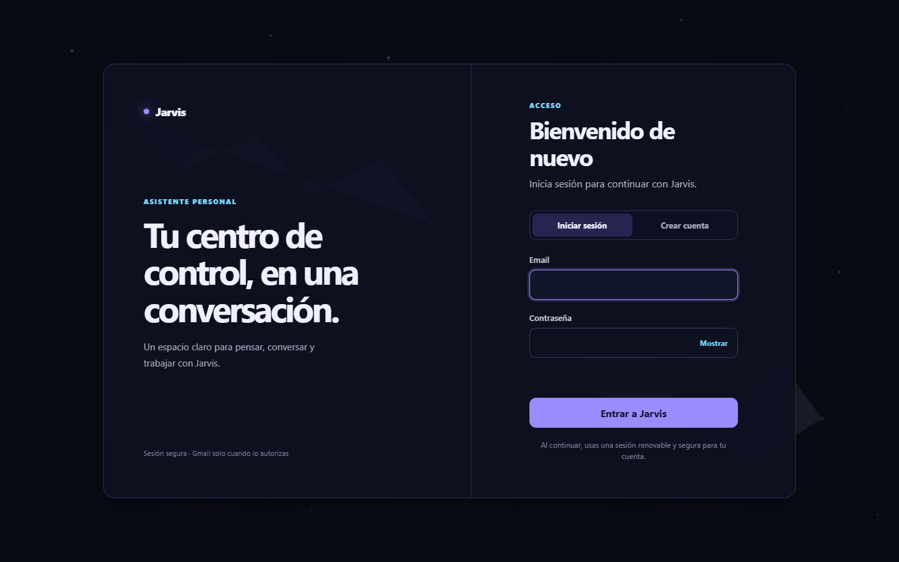
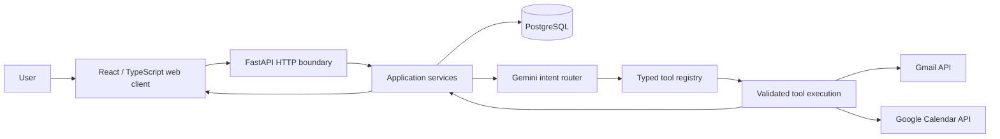

<p align="center">
  
</p>

# Jarvis Assistant

An AI personal assistant that turns natural-language requests into controlled Gmail and Google Calendar actions.

Jarvis combines a responsive React client, a layered FastAPI backend, PostgreSQL persistence, Gemini-based intent routing, and Google OAuth. It is a learning-first engineering project built to explore how a conversational product can execute real external actions without handing control of the system to the LLM.

**Current milestone:** the text-based web MVP is complete through Google Calendar. The next phase is a basic voice pipeline.

`FastAPI` · `React` · `TypeScript` · `PostgreSQL` · `Gemini` · `Gmail API` · `Google Calendar API`

## At a glance

| | Evidence |
|---|---|
| Backend tools | 26 typed tools: Gmail, Calendar, and internal capabilities |
| Automated verification | 308 backend tests passing |
| Web quality gates | TypeScript production build and Oxlint passing |
| External verification | Gmail and Calendar flows tested with a real connected Google account |
| Current client | React 19 + TypeScript + Vite |

## Product experience

Users can create an account, configure their assistant, maintain multiple conversations, connect Google through OAuth, and ask Jarvis to work with email or calendar data in natural language.

<p align="center">
  
</p>

The web application includes renewable sessions, conversation management, automatic first-message titles, Markdown responses, Google connection settings, and explicit loading, empty, error, retry, selection, and confirmation states.

### Gmail

- List and search received, sent, unread, and drafted email.
- Read exact messages or drafts, including ambiguous-result selection.
- Create single or multiple drafts and create replies inside the original thread.
- Update drafts with PATCH-like semantics, preserving fields the user did not change.
- Send a selected draft, move received or sent messages to Trash, and permanently delete drafts.
- Preserve the exact search and candidate state across conversational turns instead of asking Gemini to reconstruct it.

### Google Calendar

- Read upcoming events and find free time inside an explicit range.
- Prepare events from selected Gmail messages or drafts.
- Create, update, and delete one-time events.
- Require a separate explicit confirmation before every Calendar mutation.
- Apply confirmations only to the pending event or patch stored by the backend.

Calendar recurrence, reminders, background synchronization, automatic invitation sending, and a dedicated calendar UI are intentionally outside the current MVP.

## Architecture



The LLM selects an allowed tool and proposes structured arguments. Python code validates the request, executes the registered function, validates its result, and returns a constrained context for the final response. Gemini never calls Google APIs or the database directly.

```text
app/
├── routers/          HTTP endpoints and dependency boundaries
├── services/         business rules and orchestration
├── repositories/     PostgreSQL reads and writes
├── models/           SQLAlchemy persistence models
├── schemas/          Pydantic API, tool, and result contracts
├── integrations/     Gemini, OAuth, Gmail, and Calendar clients
└── tools/            typed tool implementations, catalog, and registry
```

The repository also contains:

- `web_app/`: active React web client.
- `tests/`: backend unit and integration-style regression coverage with provider calls mocked.
- `alembic/`: versioned PostgreSQL migrations.
- `docs/`: deeper architecture and phase contracts.

## Engineering decisions

### The model proposes; the backend decides

Tool names come from a closed registry. Pydantic validates both arguments and results, and only registered Python functions can perform an action. This keeps the LLM at the intent layer rather than treating generated output as executable authority.

### Mutations are explicit

Calendar create, update, and delete flows are two-stage operations. Jarvis first presents the exact proposal; confirmation later reuses backend-owned temporary state. The model cannot silently rebuild different mutation arguments during confirmation.

### External content is untrusted

Email and Calendar values are wrapped with instructions that treat provider data as untrusted external content. Instructions found inside an email or event cannot become system commands for the assistant.

### Sessions and provider credentials have different protections

- Passwords are hashed with bcrypt.
- Access tokens are short-lived JWTs.
- Refresh tokens rotate; only keyed hashes are stored so sessions can be revoked on rotation or logout.
- Google access and refresh tokens are encrypted at rest with Fernet.
- OAuth state is signed and time-limited.

### Ambiguity is product state

When several emails, drafts, or events match, Jarvis stores an expiring candidate set tied to the user and conversation. Follow-up selections operate on those exact candidates. This avoids collapsing search, selection, and mutation into one opaque backend shortcut.

## API surface

| Area | Routes |
|---|---|
| Health | `GET /health` |
| Authentication | `/auth/register`, `/auth/login`, `/auth/me`, `/auth/refresh`, `/auth/logout` |
| Conversations | create, paginate, read, rename, add messages, and delete under `/conversations` |
| Chat | `POST /chat` |
| Assistant settings | create, read, update, and reset under `/user_settings` |
| Google connection | connect, callback, inspect, and disconnect under `/external-auth` |

Interactive OpenAPI documentation is available at `http://127.0.0.1:8000/docs` while the backend is running.

## Run locally

The verified development environment uses Python 3.13, Node.js 24, npm 11, Docker 29, and PostgreSQL 16. Equivalent compatible versions may also work.

### 1. Start PostgreSQL

```powershell
docker compose up -d postgres
```

### 2. Configure the backend

```powershell
Copy-Item .env.example .env
.\.venv\Scripts\Activate.ps1
pip install -r requirements.txt
```

Replace every placeholder in `.env`. The Google OAuth client must authorize this callback URI:

```text
http://127.0.0.1:8000/external-auth/google/callback
```

Enable the Gmail API and Google Calendar API in the same Google Cloud project. The frontend origin expected by the local flow is `http://localhost:3000`.

### 3. Apply migrations and start FastAPI

```powershell
.\.venv\Scripts\alembic.exe upgrade head
uvicorn app.main:app --reload
```

### 4. Start the web client

In a second terminal:

```powershell
Set-Location web_app
Copy-Item .env.example .env
npm ci
npm run dev -- --port 3000
```

Open `http://localhost:3000`.

## Verification

Backend:

```powershell
.\.venv\Scripts\python.exe -m pytest -q -p no:cacheprovider
```

Current result:

```text
308 passed, 1 deprecation warning
```

Frontend:

```powershell
Set-Location web_app
npm run lint
npm run build
```

Provider calls are mocked in the automated suite. Real-account checks cover OAuth reconnection and token refresh, Gmail behavior, Calendar reads and availability, Gmail-to-event preparation, and confirmed event creation, update, and deletion.

## Project status

| Phase | Status |
|---|---|
| Backend foundation, authentication, conversations, settings, and text chat | Complete |
| Typed tool system and Google OAuth | Complete |
| Gmail tool set and backend stabilization | Complete |
| React web MVP | Complete |
| Google Calendar MVP | Complete |
| Basic voice pipeline | Next |
| Presentation infrastructure and CI | Planned |
| Persistent cross-conversation memory | Optional |
| Production deployment and proactive summaries | Planned |

This is not presented as production-ready software. Deployment automation, rate limiting, monitoring, production secrets management, and CI remain future work. Keeping those limits explicit is part of the project: the goal is to demonstrate sound backend and applied-AI engineering, not to disguise an MVP as a finished commercial platform.

## Documentation

- [Renewable session contract](docs/auth-session-refresh.md)
- [Backend stabilization and tool refactor](docs/phase-7.5-backend-stabilization.md)
- [Google Calendar MVP contract](docs/phase-9-google-calendar-mvp.md)

## Why this project exists

Jarvis is a deliberate learning project focused on backend architecture, applied AI, OAuth integrations, stateful conversational workflows, and failure-safe tool execution. The central challenge is not generating a chat response; it is translating ambiguous language into predictable, reviewable actions while keeping authority and state inside the application.
