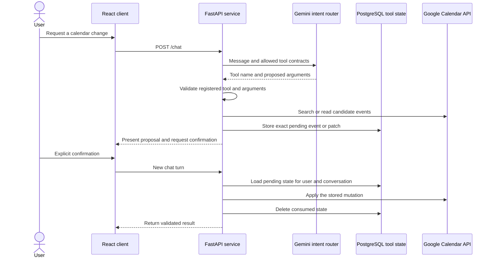

# Case study: keeping the LLM at the intent boundary

Jarvis turns natural-language requests into Gmail and Google Calendar actions. The difficult part was not producing a conversational response. It was allowing an LLM to interpret ambiguous requests without giving generated output direct authority over external systems.

The implemented solution keeps Gemini at the intent layer. Application code owns validation, state, credentials, provider calls, and every final mutation.

## The problem

A request such as “move my meeting with Ana to Friday” hides several decisions:

- Which event does the user mean?
- What should happen when several events match?
- Does “Friday” produce a valid start and end range?
- Should an LLM-generated confirmation be allowed to rebuild the event patch?
- What happens if an event description contains instructions aimed at the assistant?

Sending the model output directly to Google Calendar would make those decisions implicit. Jarvis instead represents search, selection, preparation, confirmation, and execution as separate product states.

## Design constraints

The MVP was designed around four constraints:

1. Gemini may choose only from registered backend tools.
2. Tool arguments and results must match explicit Pydantic contracts.
3. Calendar mutations require a separate user confirmation.
4. Data returned by Gmail and Calendar must remain untrusted external content.

These constraints add backend work and an extra confirmation turn, but they make each external action predictable and reviewable.

## The implemented flow

### Closed tool registry

The registry currently contains 26 internal, Gmail, and Calendar tools. Each entry maps a fixed name to a Python function and declares argument and result schemas. Unknown names are rejected, invalid arguments never reach the tool function, and invalid results are rejected before they become model context.

This makes the LLM a routing component rather than an execution environment.

### Backend-owned conversational state

Ambiguous searches and pending Calendar mutations are stored in PostgreSQL with a user ID, conversation ID, state type, JSON payload, and expiration time. A follow-up such as “the second one” is resolved against those saved candidates instead of asking Gemini to reconstruct identifiers from conversation text.

The repository intentionally keeps one active tool state per user and conversation. Creating a new state replaces the previous one. This simplifies lifecycle management and prevents unrelated pending actions from competing inside the same conversation, at the cost of not supporting several simultaneous pending workflows in one thread.

### Two-stage Calendar mutations

Create, update, and delete operations use preparation and confirmation stages:

1. Jarvis finds or builds the exact target operation.
2. The backend stores a public snapshot or patch.
3. The user sees the proposed change.
4. A later confirmation loads the stored payload.
5. Python code calls Google with that payload and clears the state.

Confirmation does not trust newly generated event details. If the expected pending state is missing or expired, no mutation is performed.

### External content boundary

Gmail messages and Calendar values can contain arbitrary text. When tool results are converted into context for the final answer, Jarvis explicitly marks every provider value as untrusted data and instructs the model not to follow commands found inside it.

This is a prompt-level defense, not a complete security sandbox. The stronger boundary is architectural: provider data cannot register tools, access credentials, or execute Python functions.

## Verification

The automated backend suite currently contains 308 passing tests. Provider network calls are mocked, so the suite verifies application behavior rather than Google availability.

Relevant coverage includes:

- rejection of unknown tools and invalid argument or result contracts;
- creation confirmation using the exact pending event;
- update confirmation applying the stored patch;
- deletion confirmation affecting only the stored event;
- no mutation when confirmation state is missing;
- candidate selection and expiration of tool state;
- treatment of tool results as untrusted external data.

The React client also passes its Oxlint check and TypeScript production build. A GitHub Actions workflow runs these backend and frontend checks independently.

## Tradeoffs and limits

The design optimizes for product clarity and controlled side effects rather than the shortest possible interaction. A confirmation turn adds friction, and persistent tool state adds database and cleanup logic. Those costs are accepted because the affected operations modify a real external account.

This MVP is not presented as production-ready. Automated tests mock Google, and deployment automation, rate limiting, monitoring, production secret management, recurring events, and background synchronization remain outside the current milestone.

## What I learned

The central lesson was that reliable AI application design depends less on a larger prompt and more on explicit software boundaries. Typed contracts constrain interpretation, persistent state preserves identity across turns, and separate preparation and execution stages make user intent observable before an external mutation occurs.

That structure also made the system easier to test: each stage can be verified independently without requiring Gemini or Google to behave deterministically during the test run.

---

[Watch the demo](https://www.youtube.com/watch?v=8YG3ozOfUQ4) · [Return to the project README](../README.md)
